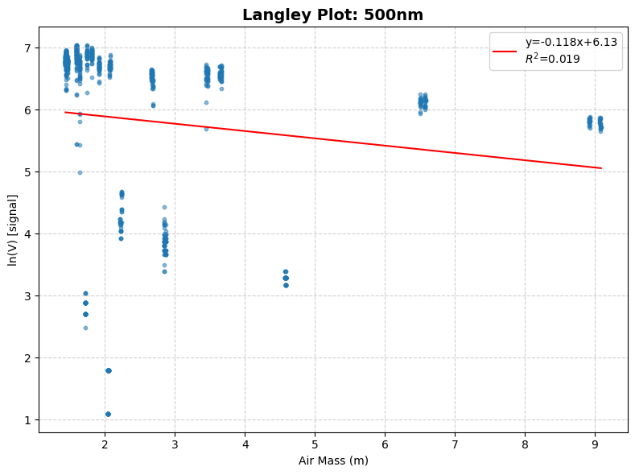

# Estimatating Solar Radiation in a Particular Location
An end-to-end workflow for extracting the data from sun-photometer (C++ sketches on Arduino IDE) to studying various important quantities derived from the data, which includes aerosol optical depth. Aerosol optical depth is then utilized to estimate the solar irradiance.

## Tools required
[Arduino IDE](https://docs.arduino.cc/software/ide/) (downloaded)

[Google Colab](https://colab.research.google.com/) or Jupyter Notebook (on browser or downloaded)

## Details of the files
* *data-extractor* is an Arduino IDE Sketch which I wrote in C++ language to extract the data from sun photometer into an SD card.

* *SunPhotometer-Data* contains readings taken by me 4 times-a-day from 10th to 17th December, 2025 from the hand-held sunphotometer. The location was [Physical Research Laboratory, Ahmedabad](https://en.wikipedia.org/wiki/Physical_Research_Laboratory) [Navrangpura] Gujarat.

* *SunPhotometer_Langley_Analysis* processes raw voltage measurements from a four-channel sun photometer (400, 500, 870, 1020 nm) collected and performs a **Langley regression** per channel to extract **V₀** (instrument's extraterrestrial calibration constant) and **τ** (column optical depth of the atmosphere).

Please click [here](#scientific-background) for the scientific background.

## Procedure of the Study
1. First you need to open the C++ sketch *data-extractor* on Arduino IDE. Then enter those dates (in ddmmyyyy format) for which readings have to be extracted from the sun photometer. 
2. Copy the console output and save it in a .txt file.
3. Open the python notebook *SunPhotometer_Langley_Analysis.ipynb* on Google Colab or Jupyter Environment.
4. The saved .txt file (for instance, *SunPhotometer-Data*) needs to be uploaded in the environment of the notebook before running a session.
5. In the notebook, go to the line `with open('SP_10_11_12_15_16_17.txt', 'r') as f:` and change the file name to the uploaded .txt file (e.g. *SunPhotometer-Data*).
6. Bingo! run the notebook.

An example of the Langley Plot for 500 nm channel:



## Scientific Background
 
### Beer–Bouguer–Lambert law
 
The attenuation of direct solar radiation passing through the atmosphere follows the Beer–Bouguer–Lambert extinction law [[1]](#references):
 
```
V(λ) = V₀(λ) · exp(−m · τ(λ))
```
 
- **V(λ)** — instrument signal at wavelength λ
- **V₀(λ)** — extraterrestrial signal (the signal at the top of the atmosphere)
- **m** — optical air mass
- **τ(λ)** — total column optical depth (aerosol + Rayleigh scattering + gas absorption)

### Optical air mass
 
The **optical air mass** *m* is the ratio of the slant atmospheric path traversed by sunlight to the vertical path. 
* Secant approximation, *m ≈ 1/cos(θ)*, breaks down near the horizon because it ignores atmospheric curvature and refraction.
 
* We used the more accurate empirical formula of **Kasten and Young (1989)** [[2]](#references), valid to large zenith angles:
 
```
m(θ) = 1 / [ cos(θ) + 0.50572 · (96.07995 − θ)^(−1.6364) ]
```
 
where θ is the true solar zenith angle in degrees.
 
### Solar position: declination and equation of time
 
Computing θ requires two intermediate astronomical quantities, both calculated in Cell 8 using the truncated Fourier-series approximations of **Spencer (1971)** [[3]](#references), in terms of the day angle Γ = 2π(N − 1)/365 (N = day of year):
 
- **Solar declination (δ)** — angle between the Sun's rays and the equatorial plane, ranging ±23.45° annually
- **Equation of time (EoT)** — difference between apparent solar time and mean clock time, from orbital eccentricity and axial tilt
```
δ = 0.006918 − 0.399912·cos(Γ) + 0.070257·sin(Γ)
     − 0.006758·cos(2Γ) + 0.000907·sin(2Γ)
     − 0.000020·cos(3Γ) + 0.000020·sin(3Γ)
 
EoT = 229.18 · (0.000075 + 0.001868·cos(Γ) − 0.032077·sin(Γ)
                − 0.014615·cos(2Γ) − 0.040849·sin(2Γ))   [minutes]
```
 
These, with the observer's longitude, give the hour angle *h*, from which the solar zenith angle follows:
 
```
cos(θ) = sin(φ)·sin(δ) + cos(φ)·cos(δ)·cos(h)
```
 
where φ is the observer's latitude.
 
### The Langley plot
 
Taking the natural log of the Beer–Bouguer–Lambert law linearizes it in *m*:
 
```
ln V(λ) = ln V₀(λ) − τ(λ) · m
```
 
Plotting ln V against m for observations taken over a single, optically stable morning or afternoon yields a straight line — the **Langley plot** — where:
 
| Quantity | Interpretation |
|---|---|
| Slope | −τ(λ), the negative of total column optical depth |
| Y-intercept (at m = 0) | ln V₀(λ), the instrument calibration constant |
| R² | Goodness of fit; low R² indicates the constant-τ assumption was violated (cloud, haze variability, instrument fault) |
 
### Aerosol optical depth (AOD)
 
The total optical depth (τ = −slope) includes aerosol, Rayleigh (molecular) scattering, and trace-gas absorption components. True **aerosol optical depth** is obtained by subtracting the Rayleigh and gas-absorption terms from τ.

## References
 
1. T. G. Mayerhöfer, S. Pahlow, J. Popp, *ChemPhysChem* (2020). 21, 2029.
2. Kasten, F., & Young, A. T. (1989). Revised optical air mass tables and approximation formula. *Applied Optics*, 28(22), 4735–4738.
3. Spencer, J. W. (1971). Fourier series representation of the position of the Sun. *Search*, 2(5), 172.

## License
 
© 2026 [Naini Diwan](https://naini-diwan.github.io/Hello-Naini/). Licensed under the MIT License.